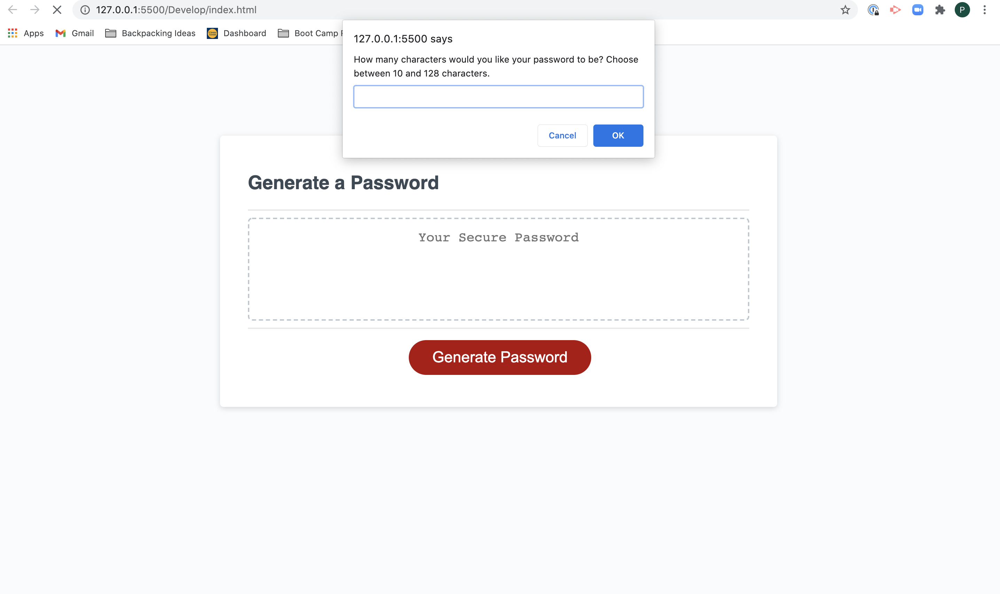

# Password Generator Starter Code

## Purpose
Working as an employee with access to sensitive data means that those employees need to be able to have strong passwords to protect company data. Using a random password generator is an easy way to create a password that meets strict criteria. Stronger passwords mean greater security for the employee and the cmopany.

This website provides the user with a complex password. The user can select if the password includes special characters, numbers, uppercase letters, and lowercase letters. The user can also decide how many characters to make the password, ranging from 8 characters to 128 characters.

## Built With
* HTML
* CSS
* Javascript

## Website
https://pmac16.github.io/password-generator/

### ©️Priya Macpherson